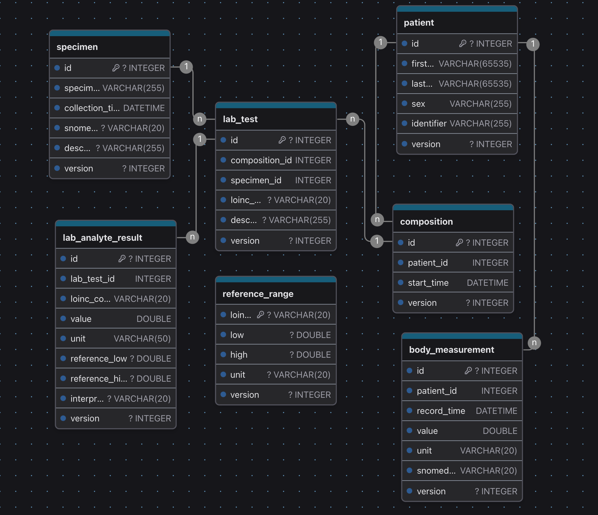

# 🩺 EHR System - Full Stack Application

This project implements a comprehensive Electronic Health Record (EHR) system featuring a FastAPI backend and an Angular frontend. It is designed for managing structured patient data, laboratory tests, and measurements with full version control, enabling both current state access and a complete audit history.

## Backend System

### 📜 Overview

The backend is an **Electronic Health Record (EHR) system** built using **FastAPI**, **SQLAlchemy**, and **SQLite**. It focuses on managing versioned patient data, lab results, and clinical compositions.

### 📐 Architecture

*   **FastAPI**: Serves as the RESTful API server.
*   **SQLAlchemy**: Used as the ORM for database modeling and access.
*   **SQLite**: The default database backend, easily swappable.
*   **Pydantic**: Employed for schemas, data validation, and serialization.
*   **Docker-friendly**: Designed to be lightweight for local or containerized deployment.

### Database Schema

The database consists of main tables for current data and history tables for audit trails.
Database is implemented in SQlite.

#### Main Tables

*   **`Patient`**: Stores patient demographic data and identifiers.
    *   `id` (Integer, Primary Key): Unique identifier for the patient.
    *   `first_name` (String): Patient's first name.
    *   `last_name` (String): Patient's last name.
    *   `sex` (String): Patient's sex.
    *   `identifier` (String): Unique patient identifier (e.g., MRN).
    *   `version` (Integer): Current version number of the record.
*   **`Composition`**: Represents a logical grouping of a clinical session (e.g., visit, encounter).
    *   `id` (Integer, Primary Key): Unique identifier for the composition.
    *   `patient_id` (Integer, Foreign Key to `Patient`): Links to the patient.
    *   `start_time` (DateTime): Start time of the composition/encounter.
    *   `version` (Integer): Current version number of the record.
*   **`Specimen`**: Contains metadata about collected biological specimens.
    *   `id` (Integer, Primary Key): Unique identifier for the specimen.
    *   `specimen_type` (String): Type of specimen (e.g., blood, urine).
    *   `collection_time` (DateTime): Time of specimen collection.
    *   `snomed_code` (String, Optional): SNOMED CT code for the specimen type.
    *   `description` (String, Optional): Additional description of the specimen.
    *   `version` (Integer): Current version number of the record.
*   **`LabTest`**: Details about a laboratory test, associated with a `Composition` and `Specimen`.
    *   `id` (Integer, Primary Key): Unique identifier for the lab test.
    *   `composition_id` (Integer, Foreign Key to `Composition`): Links to the clinical composition.
    *   `specimen_id` (Integer, Foreign Key to `Specimen`): Links to the specimen used.
    *   `loinc_code` (String, Optional): LOINC code for the lab test.
    *   `description` (String, Optional): Description of the lab test.
    *   `version` (Integer): Current version number of the record.
*   **`LabAnalyteResult`**: Stores results for individual measured analytes of a lab test.
    *   `id` (Integer, Primary Key): Unique identifier for the analyte result.
    *   `lab_test_id` (Integer, Foreign Key to `LabTest`): Links to the parent lab test.
    *   `loinc_code` (String): LOINC code for the specific analyte.
    *   `value` (Float): Measured value of the analyte.
    *   `unit` (String): Unit of measurement for the value.
    *   `reference_low` (Float, Optional): Lower bound of the reference range.
    *   `reference_high` (Float, Optional): Upper bound of the reference range.
    *   `interpretation` (String, Optional): Interpretation of the result (e.g., Normal, Abnormal).
    *   `version` (Integer): Current version number of the record.
*   **`BodyMeasurement`**: Records point-in-time physiological values (e.g., weight, blood pressure).
    *   `id` (Integer, Primary Key): Unique identifier for the body measurement.
    *   `patient_id` (Integer, Foreign Key to `Patient`): Links to the patient.
    *   `record_time` (DateTime): Time the measurement was recorded.
    *   `value` (Float): Measured value.
    *   `unit` (String): Unit of measurement.
    *   `snomed_code` (String): SNOMED CT code for the type of measurement.
    *   `version` (Integer): Current version number of the record.
*   **`ReferenceRange`**: Defines normal ranges for analytes.
    *   `loinc_code` (String, Primary Key): LOINC code for which the reference range applies.
    *   `low` (Float, Optional): Lower bound of the normal range.
    *   `high` (Float, Optional): Upper bound of the normal range.
    *   `unit` (String, Optional): Unit for the reference range values.
    *   `version` (Integer): Version of this reference range definition.

#### History Tables (Audit Trail)

Each of the main entities (`Patient`, `Composition`, `Specimen`, `LabTest`, `LabAnalyteResult`, `BodyMeasurement`, `ReferenceRange`) has a corresponding `_history` table (e.g., `patient_history`, `composition_history`, `reference_range_history`). These tables store all previous versions of the records and include:
*   A foreign key to the original entity in the main table.
*   A full snapshot of the data as it was at that version.
*   A `version` number.
*   An `updated_at` timestamp indicating when that version was archived.

This structure enables full traceability and reconstruction of historical states.

### Database Schema Diagram



*Database schema diagram showing the relationships between main entities*

### 📡 API Overview

The backend provides RESTful endpoints for managing EHR data.

#### Core CRUD Operations

All main entities (`Patient`, `Composition`, `Specimen`, `LabTest`, `LabAnalyteResult`, `BodyMeasurement`, `ReferenceRange`) generally support the following operations:

*   **`POST /<entity_name>/create`**: Creates a new entity record (e.g., `POST /patient/`).
*   **`GET /<entity_name>/{id}`**: Retrieves a specific entity record by its ID (e.g., `GET /patient/1`).
*   **`GET /<entity_name>/all`**: Retrieves a list of entity records, often with pagination (e.g., `GET /patient/`).
*   **`PUT /<entity_name>/update/{id}`**: Updates an existing entity record. This archives the current version to the history table and increments the version number of the main record (e.g., `PUT /patient/1`).
*   **`DELETE /<entity_name>/delete/{id}`**: Deletes an entity record from the main table and clears its associated history (e.g., `DELETE /patient/1`).

#### Special Routes

*   **`GET /patient/{id}/full`**: A comprehensive endpoint that fetches:
    *   Patient demographics.
    *   All compositions for a patient.
    *   All lab tests associated with those compositions, including their analytes and specimen details.
    *   All body measurements for a patient.

### ▶️ Running the Backend

#### Requirements

*   Python 3.12+
*   FastAPI
*   SQLAlchemy
*   Uvicorn

#### Installation

```bash
# Navigate to the backend directory
cd backend
# Install dependencies (example using pip and requirements.txt)
pip install -r requirements.txt
```

#### Start the server

```bash
# From the backend directory
uvicorn app.main:app --reload
```
The API documentation will be available at [http://localhost:8000/docs](http://localhost:8000/docs) via Swagger UI.

---

## Frontend System

### 🌟 Project Overview

Frontend application for the EHR System is built with **Angular**. It provides a user interface for interacting with the backend, allowing users to view and manage patient data, compositions, lab tests, body measurements, and other EHR-related information.

### ✨ Frontend Features & Capabilities

The frontend application allows users to:

*   **View Data**:
    *   Display lists of patients, clinical compositions, lab tests, individual lab analyte results, collected specimens, body measurements, and reference ranges.
    *   Access detailed views for each specific record within these categories.
*   **Manage Data**:
    *   Create new patient records.
    *   Record new clinical compositions (visits/encounters).
    *   Log new lab tests and their associated analyte results.
    *   Register new specimens.
    *   Add new body measurements.
    *   Update existing information for all manageable entities.
    *   Delete records where appropriate.
*   **Navigate**: Easily move between different sections and data views within the application using a structured routing system.
*   **User Experience**: Interact with a user-friendly interface designed for clarity and ease of managing EHR data.

### ▶️ Running the Frontend

#### Requirements

*   Node.js and npm (or yarn)
*   Angular CLI (globally or via npx)

#### Installation

```bash
# Navigate to the frontend directory
cd frontend
# Install Node.js dependencies
npm install
```

#### Start the development server

```bash
# From the frontend directory
ng serve
```
The frontend application will typically be available at `http://localhost:4200/`. The application will automatically reload if you change any of the source files.

---

# 🐳 Running the Full Application with Docker

This project is configured to run both the backend and frontend services using Docker Compose for a streamlined setup.

### Prerequisites

*   Docker Desktop (or Docker Engine and Docker Compose CLI) installed and running.

### Steps to Run

1.  **Clone the Repository (if you haven\'t already):**
    ```bash
    # git clone <repository-url>
    cd open_ehr_app
    ```

2.  **Build and Start the Services:**
    Open a terminal in the root directory of the project (i.e., where the `docker-compose.yml` file is located) and run:
    ```bash
    docker-compose up --build
    ```
    *   `--build`: This flag tells Docker Compose to build the images before starting the containers. You can omit `--build` on subsequent runs if the Dockerfiles or application code haven\'t changed significantly, and just use `docker-compose up`.
    *   The services will start in the foreground, and you\'ll see logs from both the backend and frontend.

3.  **Accessing the Application:**
    *   **Frontend**: Once the containers are up and running, the Angular frontend will be accessible at [http://localhost:80](http://localhost:80) (as per `docker-compose.yml` port mapping `80:80` for the frontend service).
    *   **Backend API**: The FastAPI backend will be available at `http://localhost:8000`. The frontend is configured to communicate with the backend at `http://backend:8000` internally within the Docker network. The API documentation (Swagger UI) can be accessed at [http://localhost:8000/docs](http://localhost:8000/docs).

4.  **Stopping the Application:**
    *   To stop the services, press `Ctrl+C` in the terminal where `docker-compose up` is running.
    *   To stop and remove the containers, you can run:
        ```bash
        docker-compose down
        ```
